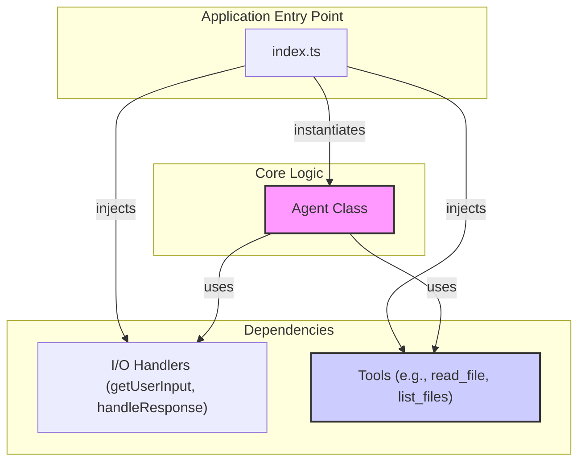

## Brief overview
This rule file outlines the preferred architectural patterns and abstraction principles for agent-related code within this project. These guidelines are derived from our recent collaboration on abstracting the agent and its tools.

## High-Level Architecture
The diagram below illustrates the dependency flow within the agent system. The entry point (`index.ts`) is responsible for composing the application by instantiating the `Agent` and injecting its dependencies, including I/O handlers and the various tools.

## Agent Abstraction
- **Encapsulation**: The core agent logic, including the Anthropic client instance and conversation flow, should be encapsulated within a dedicated `Agent` class.
- **Statelessness**: The `Agent` class should be designed to be stateless regarding conversation history. Conversation state should be managed locally within the `Agent.start()` method or passed as parameters, ensuring each session is independent.

## Dependency Management
- **Dependency Injection**: External dependencies, such as input/output mechanisms (e.g., `getUserInput`, `handleResponse`) and the collection of available `tools`, should be injected into the `Agent` class constructor rather than being instantiated internally. This promotes modularity and testability.
- **Configuration**: Agent behavior, such as logging, should be managed via a `AgentConfig` object, also passed during instantiation.
- **Decoupling**: The `Agent` should be decoupled from specific I/O implementations (like `readline`), allowing it to be reused in various environments (e.g., CLI, web, bot).

## Code Structure
- **Separation of Concerns**: Agent-specific logic should reside in its own file (e.g., `src/agent.ts`), separate from the application's entry point (`src/index.ts`).
- **Entry Point Responsibility**: The main application file (`src/index.ts`) should be responsible for setting up external dependencies (I/O, tools), instantiating the `Agent` with injected dependencies, and initiating the agent's operation.

## Tool Architecture
- **Interface Contract**: All tools must implement the `Tool` interface defined in `src/tools.ts`. This ensures a consistent structure across all tools.
- **Schema-Driven**: Each tool must define its input parameters using a `zod` schema in the `input_schema` property. This provides a reliable, typed contract for what the model can provide as input.
- **Encapsulation**: Each tool should be defined in its own file within the `src/tools/` directory. The file should export the tool object as a constant (e.g., `export const readFile: Tool = ...`).
- **Registration**: Tools are made available to the agent by including them in the `tools` array that is passed to the `Agent`'s constructor. The agent dynamically generates the `tool_specs` for the Anthropic API based on this array.