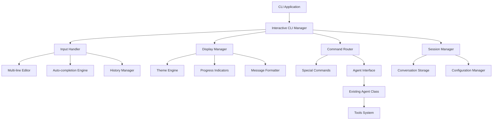

# Interactive CLI Design Document

## Overview

This design document outlines the architecture for transforming the current basic readline-based CLI into a rich, interactive command-line interface. The solution will leverage modern Node.js CLI libraries to provide enhanced user experience while maintaining the existing Agent architecture and tool system.

The design focuses on creating a modular, extensible CLI framework that can be easily customized and maintained, while providing all the interactive features specified in the requirements.

## Architecture

### High-Level Architecture



### Core Components

1. **Interactive CLI Manager**: Central orchestrator that coordinates all CLI functionality
2. **Input Handler**: Manages user input, history, auto-completion, and multi-line editing
3. **Display Manager**: Handles all visual output, theming, and formatting
4. **Command Router**: Routes special commands and regular chat messages
5. **Session Manager**: Manages conversation persistence and configuration

## Components and Interfaces

### Interactive CLI Manager

```typescript
interface InteractiveCLIConfig {
  theme: string;
  historySize: number;
  autoSave: boolean;
  progressIndicators: boolean;
  multiLineEditor: boolean;
}

class InteractiveCLIManager {
  private inputHandler: InputHandler;
  private displayManager: DisplayManager;
  private commandRouter: CommandRouter;
  private sessionManager: SessionManager;
  private agent: Agent;
  private config: InteractiveCLIConfig;

  constructor(agent: Agent, config: InteractiveCLIConfig);
  async start(): Promise<void>;
  async shutdown(): Promise<void>;
}
```

### Input Handler

```typescript
interface InputOptions {
  multiLine?: boolean;
  autoComplete?: boolean;
  history?: boolean;
}

class InputHandler {
  private historyManager: HistoryManager;
  private autoCompleteEngine: AutoCompleteEngine;
  private multiLineEditor: MultiLineEditor;

  async getInput(prompt: string, options?: InputOptions): Promise<string>;
  setupKeyBindings(): void;
  enableAutoCompletion(suggestions: string[]): void;
}
```

### Display Manager

```typescript
interface DisplayOptions {
  color?: string;
  prefix?: string;
  indent?: number;
  animate?: boolean;
}

class DisplayManager {
  private themeEngine: ThemeEngine;
  private progressManager: ProgressManager;

  displayMessage(message: string, type: MessageType, options?: DisplayOptions): void;
  showProgress(operation: string): ProgressIndicator;
  clearScreen(): void;
  displayWelcome(): void;
  formatToolUsage(toolName: string, input: any, result: any): void;
}
```

### Command Router

```typescript
interface SpecialCommand {
  name: string;
  description: string;
  handler: (args: string[]) => Promise<void>;
  autoComplete?: () => string[];
}

class CommandRouter {
  private commands: Map<string, SpecialCommand>;
  private agent: Agent;

  registerCommand(command: SpecialCommand): void;
  async routeInput(input: string): Promise<boolean>; // returns true if handled as special command
  getAvailableCommands(): SpecialCommand[];
  getAutoCompleteSuggestions(partial: string): string[];
}
```

### Session Manager

```typescript
interface ConversationMetadata {
  id: string;
  name: string;
  created: Date;
  lastModified: Date;
  messageCount: number;
}

class SessionManager {
  private configManager: ConfigurationManager;
  private storageManager: ConversationStorage;

  async saveConversation(name: string, messages: any[]): Promise<void>;
  async loadConversation(name: string): Promise<any[]>;
  async listConversations(): Promise<ConversationMetadata[]>;
  async exportConversation(name: string, format: 'json' | 'markdown'): Promise<string>;
  getConfig(): InteractiveCLIConfig;
  updateConfig(updates: Partial<InteractiveCLIConfig>): Promise<void>;
}
```

## Data Models

### Theme Configuration

```typescript
interface Theme {
  name: string;
  colors: {
    user: string;
    assistant: string;
    system: string;
    error: string;
    success: string;
    warning: string;
    tool: string;
    prompt: string;
  };
  symbols: {
    user: string;
    assistant: string;
    loading: string[];
    success: string;
    error: string;
  };
}
```

### Command History

```typescript
interface HistoryEntry {
  command: string;
  timestamp: Date;
  success: boolean;
}

interface HistoryManager {
  add(entry: HistoryEntry): void;
  getPrevious(): string | null;
  getNext(): string | null;
  search(query: string): HistoryEntry[];
  persist(): Promise<void>;
  load(): Promise<void>;
}
```

### Progress Tracking

```typescript
interface ProgressIndicator {
  start(message: string): void;
  update(message: string): void;
  succeed(message?: string): void;
  fail(message?: string): void;
  stop(): void;
}
```

## Error Handling

### Error Categories

1. **Input Validation Errors**: Invalid commands, malformed input
2. **Network Errors**: API connectivity issues, timeouts
3. **File System Errors**: Configuration file access, conversation storage
4. **Tool Execution Errors**: Tool failures, invalid parameters

### Error Handling Strategy

```typescript
interface ErrorHandler {
  handleInputError(error: InputError): void;
  handleNetworkError(error: NetworkError): void;
  handleFileSystemError(error: FileSystemError): void;
  handleToolError(error: ToolError): void;
  displayError(error: Error, context?: string): void;
}
```

### Recovery Mechanisms

- Graceful degradation when advanced features fail
- Fallback to basic readline interface if libraries fail
- Auto-retry for network operations
- User confirmation for destructive operations

## Testing Strategy

### Unit Testing

- **Input Handler**: Test command parsing, history management, auto-completion
- **Display Manager**: Test message formatting, theme application, progress indicators
- **Command Router**: Test special command routing and execution
- **Session Manager**: Test conversation persistence and configuration management

### Integration Testing

- **CLI Flow**: Test complete user interaction flows
- **Agent Integration**: Test integration with existing Agent class
- **File System**: Test conversation storage and configuration persistence
- **Error Scenarios**: Test error handling and recovery

### Manual Testing

- **User Experience**: Test actual CLI interaction and usability
- **Performance**: Test responsiveness with large conversation histories
- **Cross-platform**: Test on different terminal environments

### Test Data

```typescript
// Mock conversation data for testing
const mockConversation = [
  { role: 'user', content: 'Hello Claude' },
  { role: 'assistant', content: 'Hello! How can I help you today?' }
];

// Mock configuration for testing
const testConfig: InteractiveCLIConfig = {
  theme: 'default',
  historySize: 100,
  autoSave: true,
  progressIndicators: true,
  multiLineEditor: true
};
```

## Implementation Dependencies

### Required Libraries

1. **inquirer**: Advanced prompting and input handling
2. **chalk**: Terminal colors and styling
3. **ora**: Elegant terminal spinners and progress indicators
4. **commander**: Command-line interface framework
5. **conf**: Configuration management
6. **node-persist**: Local data persistence

### Optional Enhancements

1. **blessed**: Full-screen terminal applications (for advanced UI)
2. **figlet**: ASCII art text generation (for welcome messages)
3. **boxen**: Create boxes in terminal output
4. **gradient-string**: Gradient colored strings

## Migration Strategy

### Phase 1: Core Infrastructure
- Replace basic readline with inquirer
- Implement basic theming with chalk
- Add progress indicators with ora

### Phase 2: Advanced Features
- Implement command history and auto-completion
- Add special command routing
- Create session management system

### Phase 3: Polish and Optimization
- Add multi-line editing capabilities
- Implement conversation persistence
- Add configuration management

### Backward Compatibility

The new CLI system will maintain compatibility with the existing Agent class interface, ensuring no breaking changes to the core conversation logic or tool system.