# Code Agent Node



A Node.js-based agent application powered by Claude via the Vercel AI SDK. Showcasing that core AI agent functionality can be implemented as simply as possible.

### Current Implementation:
- agent.ts: 123 lines
- index.ts: 51 lines
- read-file.ts: 27 lines
- list-files.ts: 35 lines
- edit-file.ts: 58 lines
- types.ts: 3 lines
- Total: 297 lines

## Setup

1.  **Clone the repository:**
    ```bash
    git clone [repository-url]
    cd code-agent-node
    ```
2.  **Install dependencies:**
    ```bash
    npm install
    ```
3.  **Build the project:**
    ```bash
    npm run build
    ```
4.  **Configure environment variables:**
    Create a `.env` file in the root directory based on `.env.example` and add your `ANTHROPIC_API_KEY`.
    ```
    ANTHROPIC_API_KEY=your_anthropic_api_key_here
    ```

## Usage

To start the agent:

```bash
npm start
```

Prompt your agent:

```bash
You: Create fizzbuzz.js with fizzbuzz implementation that can be run using NodeJS
Claude: <magic>
```

Type `exit` to quit the agent.

## Testing

To run unit tests:
```bash
npm test
```

To run tests with coverage:
```bash
npm run test:coverage
```

## Credit

This repo is the TypeScript implementation of [How to Build an Agent](https://ampcode.com/how-to-build-an-agent) by [Amp](https://ampcode.com).
